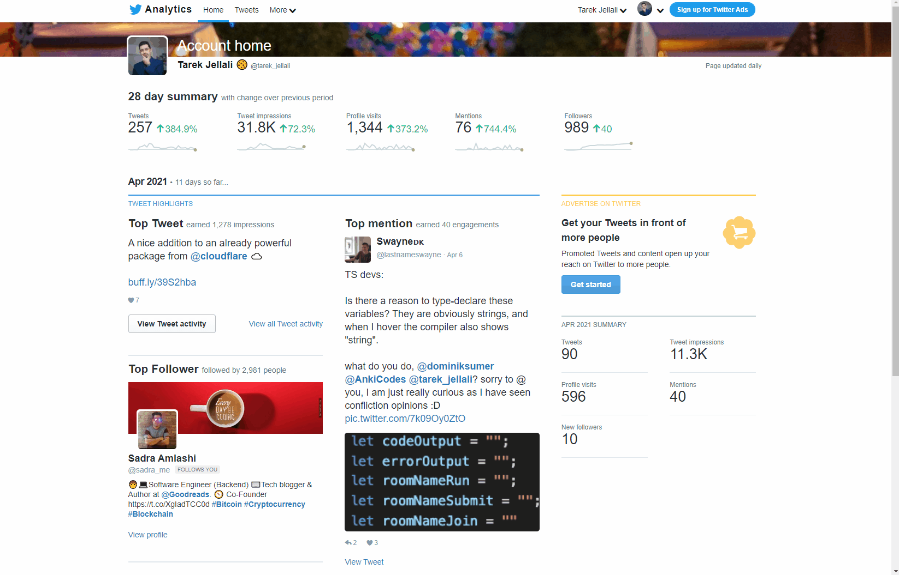

# Twitter Analytics Dark mode 🐣



Twitter Analytics Dark mode theme inspired from Monokai palette.

To use this userscript:

* If you're a Chrome ([or other Chromium-based browser](https://alternativeto.net/category/browsers/chromium-based/)) user, you'll have to install [TamperMonkey 🔳](https://chrome.google.com/webstore/detail/tampermonkey/dhdgffkkebhmkfjojejmpbldmpobfkfo).
* If you're a Firefox user, you can install [GreaseMonkey 🐵](https://addons.mozilla.org/en-US/firefox/addon/greasemonkey/).

[Next to install the script just click here 💾](https://github.com/tarkant/twitter-analytics-dark-theme/raw/master/dist/twitter-analytics-dark-theme.user.js)

## Make it your own 🌈

You can change the color palette and customize this dark mode as you wish, just head to `./src/scss/style.css` and you'll find the following:

```scss
// The base background for the whole page and the navbar
$background: #1b1d1e;
// Color of the heart icon on your Top tweet for example
$background-ligher: #75715e;
// Background color used for dropdown menus in the navbar and "Top Follower" card
$background-darker: #272820;
// Text color of some buttons
$black: #000;
// Buttons, links and borders color
$blue: #66d9ef;
// Text color for almost everything
$white: #fff;
// Empathy text for small titles and the "Advertise on twitter" section
$yellow: #e6db74;
// 28 day summary text as well as the sub-header with "Month 2021"
$orange: #fd971f;
// Red color for the negative metric values
$danger: #f92672;
// Green color for the positive metrics
$success: #a6e22e;
```

Below is simple CSS, selectors are a little messy but they do the job. Make sure to post an issue if something is not working correctley.

## 🆘 Issues and contributions

If you have an issue with the boilerplate or want to contribute, please let me know I'll be happy to interact with you.

## ⏲ Changelog

- v1.1.0: fix: dark theme in tweets page
- v1.0.0: Initial version